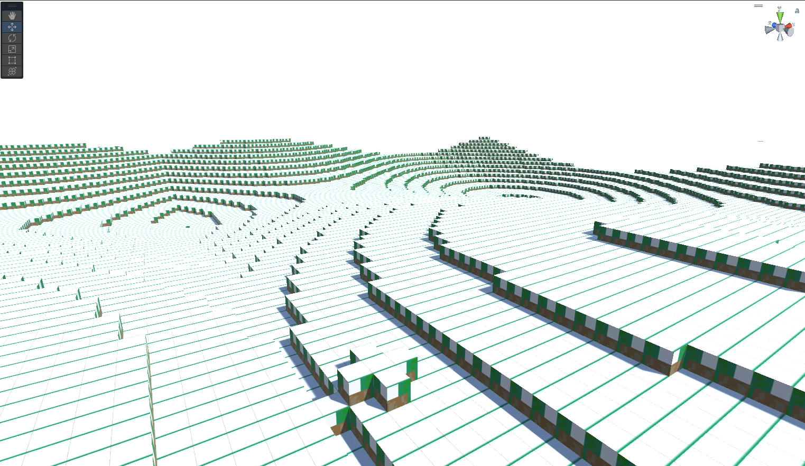

# Cellular-Automata-in-Voxel-World

Using Unity 3D.  Procedurally generated voxel world with multithreaded mesh generation.  Ceullar automata included.

## 🔧 W.I.P.
Project still contains many bugs: i.e. out of sync mesh rendering.

## Pics or it didn't happen

